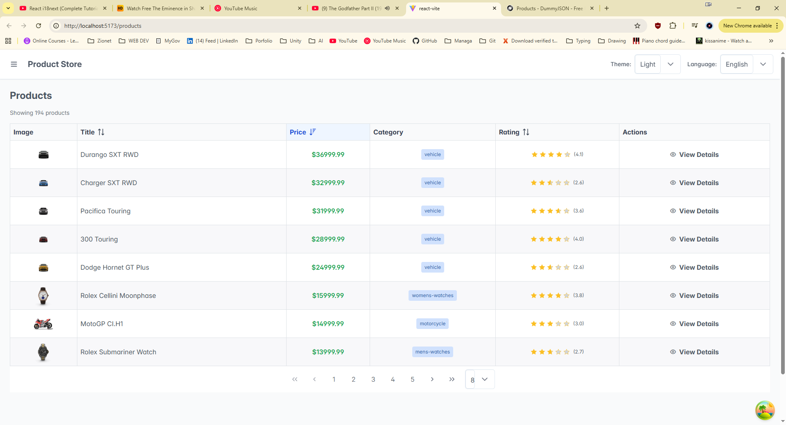
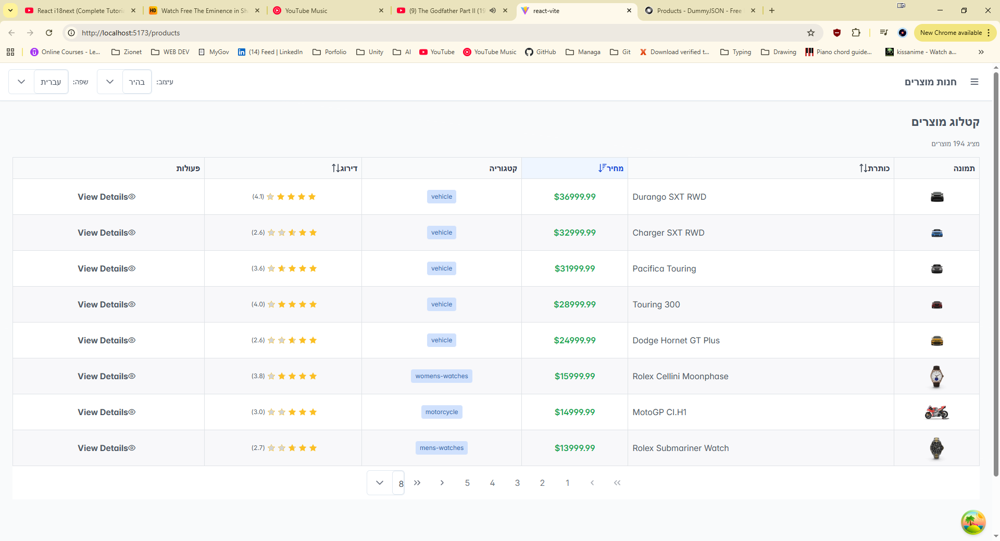
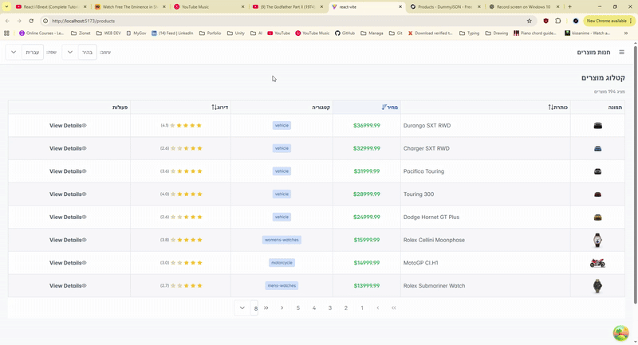
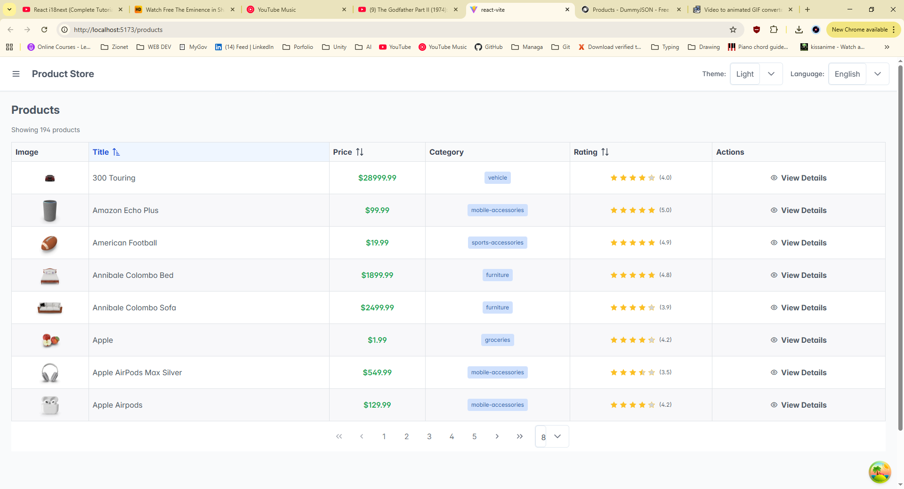
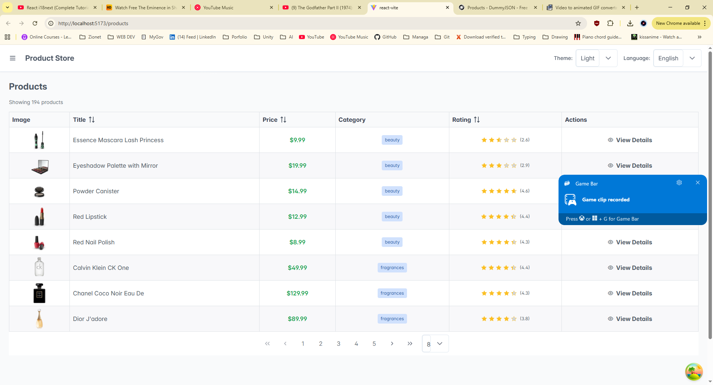
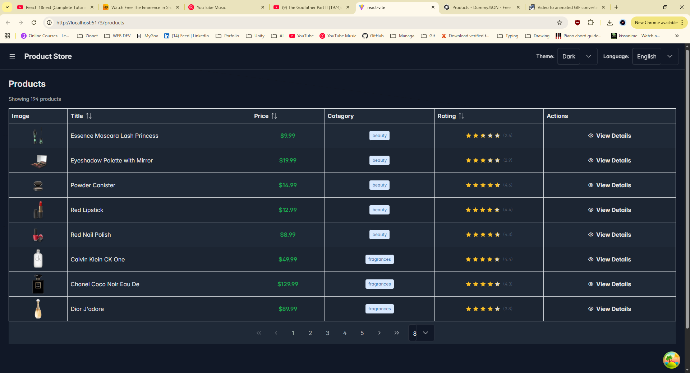

# React Store App - Advanced 1 Homework

## Step 0 - Prep (Path A)

Starting Advanced 1 from commit `b4e02aa2a74cbbe42ff2e3acf3a58a0f87ba5355`.

API used: DummyJSON (https://dummyjson.com)

---

## Step 1 - i18n Setup

**Locales:** English (en), Hebrew (he)

**Namespaces:**
- `common` - header, buttons, generic UI labels, theme/language switcher, footer
- `products` - product list, detail page strings

**Screenshot:**

---

## Step 2 - i18n Required Features

**Example keys and locations:**

1. **Interpolation:**
   - Key: `products:resultsCount` → `"Showing {{count}} results"`
   - Location: Products list page, below title

2. **Pluralization:**
   - Key: `products:resultsCount` uses `count` for plural forms
   - Location: Products list page (same as interpolation)

3. **Trans Component:**
   - Key: `common:termsAgreement` → `"By using this site, you agree to our <1>Terms of Service</1>"`
   - Location: Footer component (bold text embedded in translation)

---

## Step 3 - Language Switcher + Persistence

**How persistence works:**
- i18next-browser-languagedetector saves selected language to localStorage under key `app-language`
- On page load, detector reads from localStorage and restores the language
- If no language stored, defaults to English

**Screenshots:**

---

## Step 4 - RTL Mode

**RTL Fixes:**
1. **Sidebar positioning** → Fixed with Tailwind `ltr:ml-64 rtl:mr-64` classes
2. **Filter sidebar positioning** → Fixed with `ltr:left-0 rtl:right-0` classes

**Screenshot:**

---

## Step 5 - PrimeReact DataTable

**DataTable Features Implemented:**
1. **Sorting** - Title, Price, and Rating columns (server-side sorting via API)
2. **Pagination** - Lazy pagination with page size options: 4, 8, 12

**Screenshot:**

---

## Step 6 - PrimeReact Theme Switcher

**localStorage key:** `app-theme`

**Default theme:** `light`

**Screenshots:**

