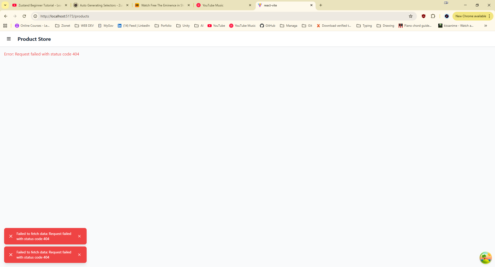
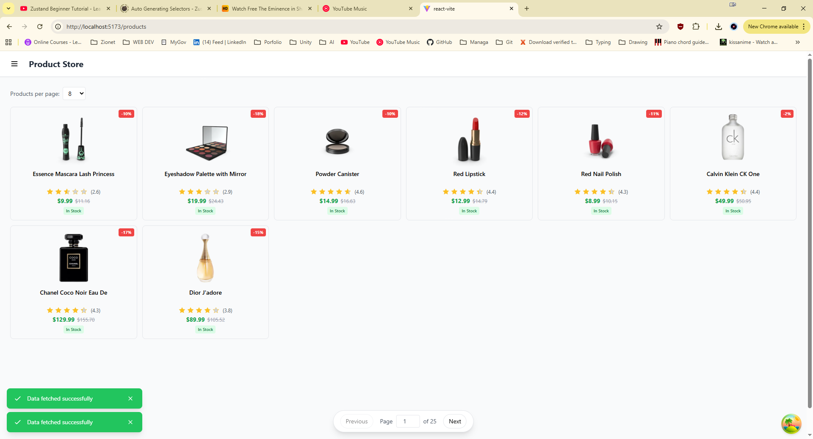
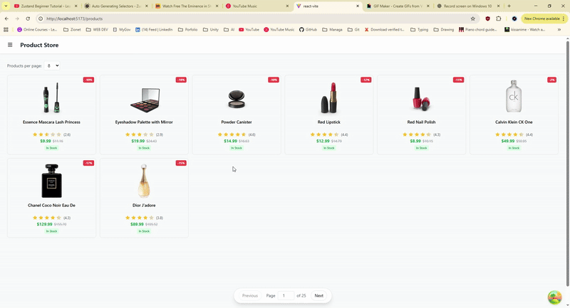

# State Inventory

This document lists all pieces of state in the project and categorizes them by type.

---

## Server State (TanStack Query)

| State | Hook | Location | Description |
|-------|------|----------|-------------|
| Products List | `useProducts` | `src/hooks/useProducts.ts` | Paginated product data from API with `keepPreviousData` for smooth pagination |
| Product Details | `useProduct` | `src/hooks/useProducts.ts` | Single product by ID |
| Categories | `useCategories` | `src/hooks/useCategories.ts` | List of product categories |
| Prefetch Product | `usePrefetchProduct` | `src/hooks/usePrefetchProduct.ts` | Optimistic prefetching on hover |

---

## Global Client State (Zustand)

### Filter Store

| State | Store | Location | Description |
|-------|-------|----------|-------------|
| `search` | `useFilterStore` | `src/stores/filterStore.ts` | Applied search query (sent to API) |
| `searchInput` | `useFilterStore` | `src/stores/filterStore.ts` | Search text being typed |
| `category` | `useFilterStore` | `src/stores/filterStore.ts` | Selected category filter |
| `page` | `useFilterStore` | `src/stores/filterStore.ts` | Current pagination page number |
| `pageSize` | `useFilterStore` | `src/stores/filterStore.ts` | Number of products per page |

**Actions:**
- `setSearchInput(input)` - Update search input text
- `applySearch()` - Apply search input as active search, reset page to 1
- `clearSearch()` - Clear search input and active search
- `setCategory(category)` - Set category filter (clears search if category selected)
- `setPage(page)` - Set current page
- `setPageSize(size)` - Set page size, reset page to 1
- `resetFilters()` - Reset all filters to defaults

**Why Zustand?** Filter state was moved from local `useState` in `ProductList.tsx` to a global Zustand store so that `FilterSidebar` can be rendered in `App.tsx` and be accessible from any page (including `ProductDetail`). When filters are applied from non-products pages, the app navigates to `/products`.

### Toast Store (Step 4)

#### Step 4.1 — Library Choice

**Library:** Zustand

**Why Zustand?** I was familiar with the library and saw it as most fitting for this use case.

**Store Location:** `src/stores/toastStore.ts`

#### Step 4.2 — Notification Shape

| Field | Type | Required | Description |
|-------|------|----------|-------------|
| `id` | `string` | Yes | Unique identifier (timestamp + random string) |
| `message` | `string` | Yes | The notification text to display |
| `type` | `'success' \| 'error' \| 'info' \| 'warning'` | Yes | Determines toast styling/color |
| `duration` | `number` | No | Auto-dismiss time in ms (default: 5000, 0 = never) |

**Store State:**
| State | Type | Description |
|-------|------|-------------|
| `toasts` | `Toast[]` | Array of active toast notifications |

**Store Actions:**
| Action | Description |
|--------|-------------|
| `addToast(message, type?, duration?)` | Add a toast notification, auto-removes after duration |
| `removeToast(id)` | Remove a specific toast by ID |
| `clearToasts()` | Remove all toasts |

#### Step 4.3 — ToastContainer Component

**Location:** `src/lib/components/ToastContainer.tsx`

**How it works:**
- Subscribes to `useToastStore` to get the list of toasts
- Renders toasts in a fixed position container (bottom-right)
- Each toast has different styling based on `type`:
  - `success` → green background
  - `error` → red background
  - `info` → blue background
  - `warning` → yellow background
- Each toast has a close button (×) to manually dismiss
- Mounted in `App.tsx` at the root level

**Screenshots:**
- Error toast: 

- Success toast:  

---

## Global Client State (Context) — Sidebar

### Step 2.1 — Sidebar Choice

**Type:** Filter Sidebar

**What opens it:**
- Hamburger menu button in the Header component (top-left)

**Where it appears:**
- Left side of the screen
- Fixed position, slides in from the left
- Overlay on mobile (with dark backdrop), push content on desktop
- Contains search input and category filter

### Step 2.2 — Layout/UI Context Design

**Context State:**
| State | Type | Description |
|-------|------|-------------|
| `isOpen` | `boolean` | Whether the sidebar is currently visible |

**Context Actions:**
| Action | Description |
|--------|-------------|
| `open()` | Opens the sidebar |
| `close()` | Closes the sidebar |
| `toggle()` | Toggles sidebar open/closed state |

**Provider Location:**
- `SidebarProvider` wraps the entire app inside `Router` in `App.tsx`
- This ensures all routes have access to sidebar state

**Components that READ from context:**
- `Header` - reads `isOpen` to show active state on toggle button
- `FilterSidebar` - reads `isOpen` to show/hide itself
- `ProductList` - reads `isOpen` to adjust content margin

**Components that TRIGGER actions only:**
- `Header` - calls `toggle()` on hamburger button click
- `FilterSidebar` - calls `close()` on overlay click and close button

### Step 2.3 — Context Summary

**SidebarContext** manages the visibility state of the filter sidebar across the application.

| Field/Action | Type | Description |
|--------------|------|-------------|
| `isOpen` | `boolean` | Current visibility state of the sidebar |
| `open()` | `() => void` | Sets `isOpen` to `true` |
| `close()` | `() => void` | Sets `isOpen` to `false` |
| `toggle()` | `() => void` | Flips `isOpen` between `true`/`false` |

The context is consumed via the `useSidebar()` hook, which throws an error if used outside the provider. State is persisted to localStorage under the key `"sidebar-open"` so it survives page refreshes.

**Screenshot:**


### Step 3 — localStorage Persistence

**Custom Hook:** `useLocalStorage<T>(key, defaultValue)`

**How it works:**
- On first load: tries `localStorage.getItem(key)`, parses JSON, falls back to `defaultValue` if missing/invalid
- On every change: saves new value to localStorage via `JSON.stringify()`
- Uses `useState` internally with lazy initializer to avoid SSR issues
- `useEffect` syncs state changes back to localStorage

**Test Results:**
- Opened sidebar, refreshed → still open ✓
- Closed sidebar, refreshed → still closed ✓

**Files:**
- `src/context/SidebarContext.ts` - Context definition
- `src/context/SidebarProvider.tsx` - Provider component with localStorage persistence
- `src/hooks/useSidebar.ts` - Consumer hook
- `src/hooks/useLocalStorage.ts` - Custom hook for localStorage persistence

---

## Client/UI State (Local - useState)

| State | Component | Type | Description |
|-------|-----------|------|-------------|
| `pageInput` | ProductList.tsx | Local | Text input for direct page navigation (synced with store's `page`) |

---

## URL State

| State | Component | Description |
|-------|-----------|-------------|
| Product ID (`:id`) | ProductDetail.tsx | Product ID from route `/products/:id` |

---

## Component Hierarchy for Global State

```
App.tsx
├── SidebarProvider (Context)
│   ├── Header (uses useSidebar for toggle button)
│   ├── FilterSidebar (uses useSidebar + useFilterStore)
│   ├── Routes
│   │   ├── ProductList (uses useSidebar + useFilterStore)
│   │   └── ProductDetail (can access sidebar via useSidebar)
│   └── ToastContainer (uses useToastStore)
```

---

## Conclusion

1. **TanStack Query**: All data fetched from the backend (products, categories, product details) correctly lives in TanStack Query. This handles caching, syncing, and refetching automatically. The `keepPreviousData` option provides smooth pagination UX.

2. **Global Client State (Zustand)**:
   - **Filter Store**: Search, category, and pagination state are now global via Zustand. This allows `FilterSidebar` to be rendered at the app level and accessible from any page, solving the issue of the sidebar being unavailable on `ProductDetail`.
   - **Toast Store**: Global notification system for displaying toasts across the app.

3. **Global Client State (Context)**: Sidebar visibility is implemented using React Context with localStorage persistence via the custom `useLocalStorage` hook. This allows the sidebar state to persist across page refreshes.

4. **Local UI State (useState)**: Only `pageInput` remains as local state in `ProductList.tsx` since it's a temporary input value that syncs with the store's `page` state.
